

<picture>
  <source media="(prefers-color-scheme: dark)" srcset="assets/hero-dark.svg">
  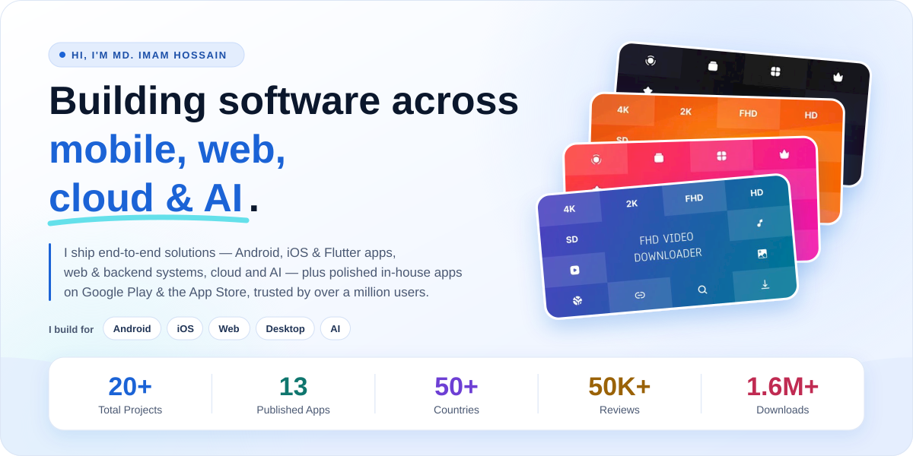
</picture>

- 🔭 I'm currently building end-to-end solutions across mobile, web, cloud & AI.
- 🌱 Currently learning: SwiftUI.
- 💬 Ask me about: Kotlin, Flutter.
- 📱 Apps: [Google Play](https://play.google.com/store/apps/dev?id=5785086860664884952) · [App Store](https://apps.apple.com/us/developer/imam-hossain/id6797708668) · [See them below](#apps)
- 📫 Hire me: [newagedevs.com/contact](https://newagedevs.com/contact)

## Tech Stack

<!-- stack:start -->

<!-- stack:end -->

## GitHub Stats

**Note:** This chart only shows which languages appear in public code on GitHub. It does not reflect experience or skill level.

## Apps

Apps I've built and published under [NewAgeDevs](https://newagedevs.com), available on Google Play and the App Store.

<!-- apps:start -->
### Downloaders

`5 apps` `Android` Save videos, reels, stories and photos from your favorite social apps.

[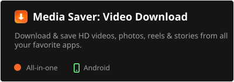](https://play.google.com/store/apps/details?id=com.newagedevs.mediasaver)
[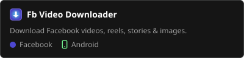](https://play.google.com/store/apps/details?id=com.newagedevs.facebook_video_downloader)
[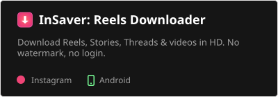](https://play.google.com/store/apps/details?id=com.newagedevs.reels_video_downloader)
[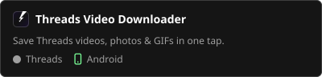](https://play.google.com/store/apps/details?id=com.newagedevs.threads_video_downloader)

### Tools

`6 apps` `Android` `iOS` Everyday utilities for audio, your phone, network, links, privacy and travel.

[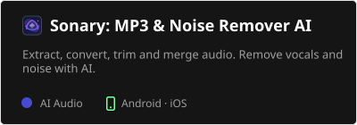](https://play.google.com/store/apps/details?id=com.newagedevs.sonary)
[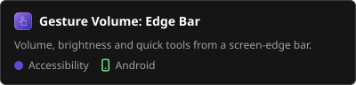](https://play.google.com/store/apps/details?id=com.newagedevs.gesturevolume)
[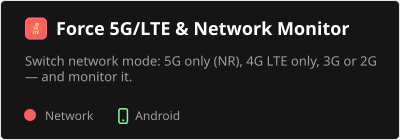](https://play.google.com/store/apps/details?id=com.newagedevs.enable_network)
[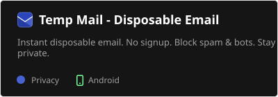](https://play.google.com/store/apps/details?id=com.newagedevs.temp_mail)
[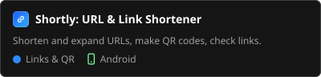](https://play.google.com/store/apps/details?id=com.newagedevs.url_shortener)
[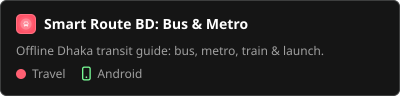](https://play.google.com/store/apps/details?id=com.newage.bdbusroute)

### Widgets & Games

`2 apps` `Android` `iOS` Home-screen widgets and casual games.

[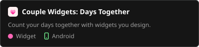](https://play.google.com/store/apps/details?id=com.newagedevs.couplewidgets)
[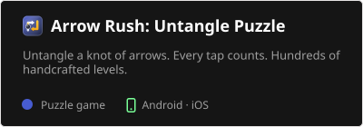](https://play.google.com/store/apps/details?id=com.newagedevs.arrow_rush)
<!-- apps:end -->

**Note:** This list only covers apps published on Google Play and the App Store. Client, private and ongoing projects aren't listed, so it doesn't reflect everything I've built.
